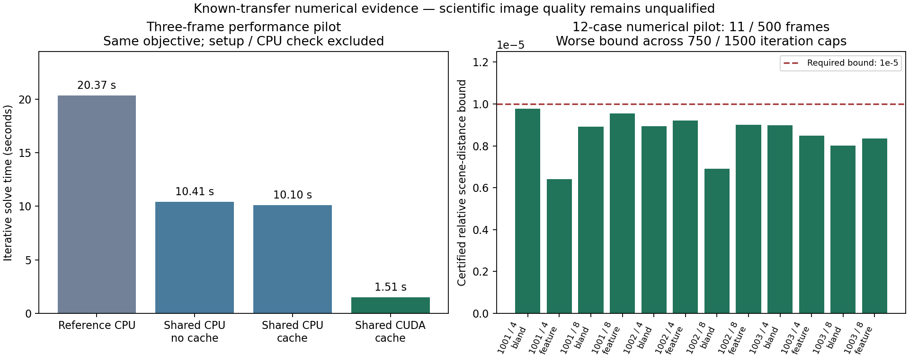

# Complete development numerical pilot

2026-09-08. **All 12 cases and all 24 fits pass the declared numerical checks.**
This qualifies the fixed 11-frame numerical control across seeds 1001–1003,
D/r0 = 4 and 8, and feature/bland crops. It does not qualify 500-frame selections,
the scientific prior, blind reconstruction, Gate-1, Q2, Q3 or production quality.

The [prospective protocol](../../docs/scene-family-pilot-protocol.md) fixes native
cells, the finite optical influence domain with a 64-detector-pixel margin,
SUM prior 0.0003, observed-data scalar variance, zero starts, and independent
750/1500 iteration caps. The reference prior is deliberately separate from the
[unbracketed weak-prior study](../p2-prior-extension/DECISION.md).
No latent truth, expected-image values, selection or assessment pixels enter
this numerical matrix. There are 11 observations per fit, drawn from each
500-frame capture; the captured count is not the processed count.

Independent CPU certificates bound relative scene error by 6.42e-6–9.78e-6,
below the required 1e-5. Fits stop after 180–330 iterations. Every pair has zero
measured latent and detector image change, below the declared 1e-4 limit.
Both caps stop when certified, so doubling the cap does not force extra steps;
the independent distance bound establishes accuracy beyond image stability.

The complete run took 383.80 s using two spawned CUDA workers, each with two CPU
threads on the local RTX 5070. Per-worker retained PSF spectra peaked at
194,912,256 or 207,888,384 bytes within the 256 MiB cache bound. Largest recorded
process high-water RSS was 1,440,624,640 bytes. RSS is per process and can include
earlier cases; these values do not bound total host memory or driver VRAM.
The cache holds all 11 spectra; this result does not establish 500-frame cache
behaviour or a general hardware speedup.

[Report](report.json), [protocol and identities](protocol.json) and per-case
protocol/report files are preserved byte-for-byte from the run and covered by
[checksums](checksums.json). Source and input identities remained unchanged.
Image/checkpoint arrays remain in ignored local output, outside the Git archive.

The performance panel uses the separate three-frame benchmark and excludes
setup and the independent CPU certificate. It is not the family wall time.
Rebuild this figure with `python3 tools/plot_scene_pilot.py` where Matplotlib is
available; numerical JSON reports remain authoritative.

Validation for this implementation sequence: 683 default regression tests passed
(44 skipped); 25 targeted CPU/CUDA operator and iteration-state tests passed on
the supported GPU. Additional family deadline/resume and archived evidence
checks are run separately. Hardware resume preserves both a converged control
and a deliberately incomplete weak-prior control without changing tolerances.

Next: bounded full-frame resource profiling and a prospective complete-selection
protocol, followed by prior/likelihood/phase qualification and scientific gates.
Preserve the current unresolved prior result; do not extend its grid automatically.
