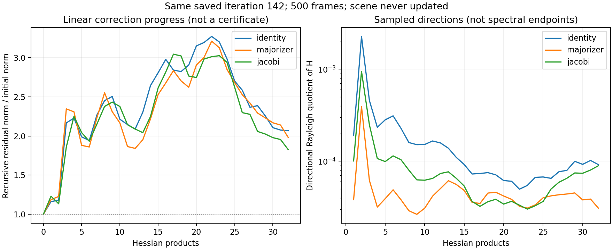

# True Hessian-diagonal probe and comparison

The prospectively declared Jacobi-only diagnostic completed all 32 products in
191.27 seconds including setup and independent verification. Input, source,
manifest and original checkpoint identities stayed unchanged. No scene was
updated. The true native-cell diagonal passes 14 independent dense-matrix tests
covering detector integration, exposure averaging, cropping, masks, RGB/CFA and
regularization. It is used only as a preconditioner, never as a step majorizer.

Diagonal construction took 29.16 seconds with eight ordered CPU workers. Its
range is [6e-7, 1.34714e-5]; the old majorizer divided by this diagonal has median
174.41, 95th percentile 1183.91 and maximum 2008.61. These are diagonal ratios,
not condition numbers. Process peak RSS was 5,248,458,752 bytes; the 256 MiB cache
limit covers retained CUDA PSF spectra only.

| Scaling | Products | Terminal recursive residual / initial | Checked relative distance bound |
|---|---:|---:|---:|
| Identity | 32 | 2.06754 | 0.149922 |
| Existing majorizer | 32 | 1.98179 | 0.149922 |
| True Hessian diagonal | 32 | 1.82641 | 0.149922 |

Jacobi's independently recomputed CPU/CUDA product relative error is 3.04e-14,
below 1e-10. It produced a somewhat smaller terminal linear residual, but no
tighter bound. This is insufficient to select a production preconditioner, and
increasing Euclidean CG residual alone does not establish divergence. Timing
differences between invocations are not an isolated performance comparison.



Reproduce the figure with system Python and Matplotlib:

```sh
MPLCONFIGDIR=/tmp/planetrecon-mpl OPENBLAS_NUM_THREADS=2 python3 tools/plot_scene_conditioning.py results/p2-frozen-conditioning results/p2-frozen-jacobi --output results/p2-frozen-jacobi/comparison.png
```

The [earlier algebraic floor](../p2-frozen-conditioning/interpretation.json)
already rules out 1e-5 certification of this saved iterate using this particular
fixed-residual energy/global-ridge bound, even for an exact inner solve. It is
not a lower bound on actual reconstruction error. Further identical inner probes
cannot resolve that limitation. Next, develop and independently validate a
feasible constrained update that addresses coupled curvature, then predeclare a
bounded same-objective comparison. Keep the existing independent certificate,
prior, tolerances, failed outcomes and scientific qualification boundaries.

Validation this turn: full regression 757 passed / 46 skipped before the final
analysis and Jacobi additions; all 31 targeted conditioning, checkpoint, analysis
and diagonal tests then passed. All 500-frame fits remain incomplete. No GUI
solver change, full-family expansion, scientific prior selection or Q3 follows.
