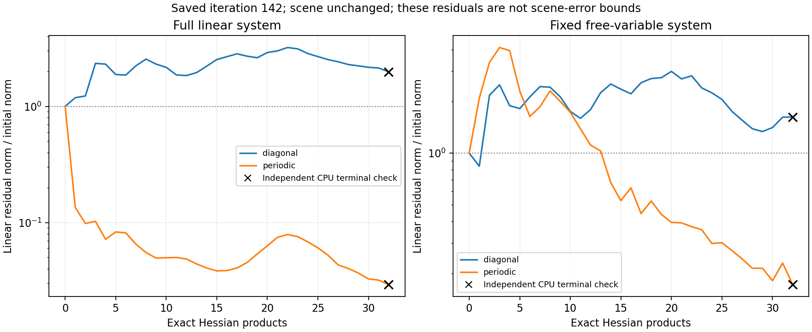

# Coupled-inverse frozen probes

All four declared32-product probes completed with unchanged source, input,
manifest and checkpoint identities in341.89 seconds. The saved iteration142
scene was never updated. Independent CPU/CUDA product relative errors are
<=4.03e-14, below1e-10; periodic inverse construction took17.05 seconds.

| Linear system | Scaling | Independent system residual / initial | Full residual / initial | Scene-distance upper bound |
|---|---|---:|---:|---:|
| Full | Diagonal | 1.98179 | 1.98179 | 0.149922 |
| Full | Periodic inverse | 0.0292001 | 0.0292001 | 0.0421787 |
| Fixed free variables | Diagonal | 1.62320 | 2.42047 | 0.149922 |
| Fixed free variables | Periodic inverse | 0.171700 | 1.76382 | 0.149922 |

The periodic inverse improves the terminal full-system residual about68 times
and the free-system residual about9.5 times under equal product caps. Its full
correction tightens the conservative distance bound, but remains far above1e-5.
The reduced residual omits fixed-coordinate components; it is **not** a bound
on the full residual or reconstruction error. All correction bounds use the full
independently recomputed H*y, including components outside the free set.

The real positive Fourier symbol lies in[6e-7,0.0143579]. These are eigenvalue
bounds for the approximate periodic operator, not the true finite-domain Hessian.
The existing fixed-residual certificate floor and incomplete historical solves
remain unchanged. Euclidean residual increases within CG alone are not failure
or divergence; terminal independent checks govern this comparison.

Thirteen focused controls verify positive full/reduced inverses, toroidal dense
convolution, detector integration, Bayer green density, wrapped kernels, invalid
inputs and recovery of the actual finite-detector linear solution. This evidence
supports one newly declared constrained endpoint experiment using this inverse,
with the original descent safeguard and independent certificate. It does not
authorize prior tuning, relaxed budgets, production use or scientific gates.
