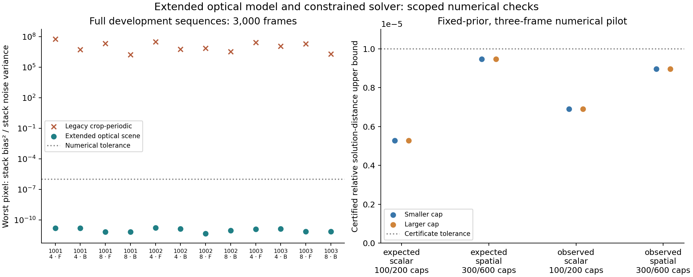

# Qualified full-optical-grid pilot; scientific family still open

All four fixed-prior numerical cases now certify their constrained solutions at
both declared budgets, with identical doubled-budget images. The scene has
1152×1152 unknown optical cells; observations are three full 128×128 feature
frames (0, 249, 499) from development seed 1001, D/r0=4. Initialization is zero;
no latent truth supplies scene margins or optimization inputs except the explicitly
labelled oracle variance maps.

| Data / variance weights | Iteration caps | Actual iterations in each solve | Relative solution error bound |
|---|---:|---:|---:|
| Noiseless / scalar | 100 / 200 | 30 | 5.27e-6 |
| Noiseless / spatial | 300 / 600 | 120 | 9.48e-6 |
| Observed / scalar | 100 / 200 | 30 | 6.91e-6 |
| Observed / spatial | 300 / 600 | 230 | 8.96e-6 |

All bounds are below the unchanged 1e-5 tolerance. The diagonal majorizer is a
coordinate scaling of the same objective, not a different prior or a softened
convergence rule. The targeted spatial budgets followed measured contraction;
the original [v1 failures](../p2-scene-noise-v1/DECISION.md) and
[v2 100/200 outcomes](../p2-scene-noise-v2-initial/DECISION.md) remain archived.
The independent dense controls check active constraints, multiple starts,
majorizer bounds, KKT residuals and distance/objective error certificates.

## What the noise comparison does and does not establish

At this fixed ridge (0.001) and domain, switching scalar to spatial weights changes
the reconstructed detector image by 3.31% for noiseless and 3.34% for observed
data. Observed versus noiseless image changes are 1.26% with scalar and 1.04%
with spatial weights. Relative detector-truth MSE is 0.00704/0.00717 for scalar
noiseless/observed and 0.01062/0.01071 for spatial noiseless/observed.

These are valid numerical descriptions of this pilot, not a variance-model
recommendation. The noiseless difference confirms that weighting interacts with
the fixed regularizer even after correcting image formation. The prior/domain
has not been selected or qualified; the likelihood is a frozen oracle-weighted
quadratic, not exact Poisson-plus-read inference or a truth-free real-data fit.
No bias/variance conclusion generalizes from this single seed/regime/crop.

The largest pilot used 285.80 s for setup and two 230-iteration solves while other
CPU work ran. This is a complete-job observation, not a controlled speedup
benchmark. Repeating full optical convolution for hundreds of frames will need
profiling, shared FFT work and bounded caches/backend experiments before a large
family run. Runtime forecasts must include the actual objective and data size.

## Next acceptance work

1. Declare domain/ridge/sampling sensitivity and photon-budget normalization rules,
   including truth-free development selection and separate assessment. Retain
   the numerical certificate while varying these scientifically material choices.
2. Profile and bound repeated full-scene forward/adjoint work; test shared/cached
   transforms and CPU/CUDA parity before accelerating the qualified operator.
3. Run the complete development family and selection fractions under a frozen
   protocol, then qualify noise/phase/exposure inference and Gate-1/Q2.

The [3,000-frame forward-consistency result](../p1-scene-detector-full/DECISION.md)
is complete for its scope. This three-frame solver/noise pilot does not complete
P2/P3, authorize Q3, or qualify a production atmospheric reconstruction feature.
The GUI baseline and user-selected sharpening behavior are unchanged.

The full CPU regression suite passed 652 tests with 41 optional tests skipped;
two subsequent archive-integrity checks passed. No GPU, Windows or macOS runtime
qualification was performed in this step. All inputs remain private/ignored.
