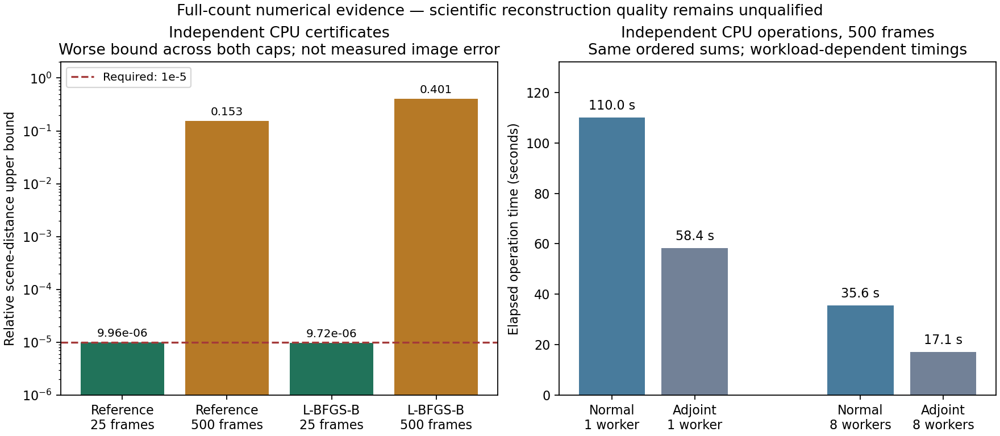

# Full-count development decision

2026-09-08. **Full-frame computation is now measured and tested; full-frame
reconstruction remains numerically incomplete under the declared budgets.**
The observed manifest freezes all 60 development selections before fitting.
The bounded endpoint studies preserve the same objective and independently
verify their certificates; they do not establish an optimal prior or image quality.

| Endpoint | Reference | Scaled L-BFGS-B |
|---|---|---|
|25 frames, 5%|Both caps certify; 310 iterations|Both caps certify; 195 iterations|
|500 frames, 100%|Both fits time-limited; uncertified|Both fits time-limited; uncertified and unstable between budgets|

At 25 frames the objective difference is 5.63e-7, within the summed independently
certified objective-gap bounds of 2.60e-6 (before the separate roundoff allowance).
The [comparison report](report.json) checks the input/manifest, actual selected
indices, domain, prior and numerical criteria before making that comparison.
It does not use incomplete all-frame fits as accuracy baselines or promote a
stale pass flag over a failed certificate.

The [full-count GPU profile](../p5-full-count-profile/DECISION.md) passes operator
parity through 500 frames with relative differences below 9e-16. Its small cache
churns at larger frame counts, but shared CUDA remains useful. The subsequent
[parallel CPU verifier](../p5-parallel-reference/DECISION.md) preserves bit-for-bit
ordered normal/adjoint arrays at 500 frames while measuring lower operation costs
in this run. Timings overlap other work and are not isolated speed benchmarks.

**Next step:** retain convergence/evaluation traces and diagnose conditioning and
preconditioning on this frozen native objective before choosing another resource
budget or expanding to the full selection family. Use the qualified parallel
CPU verifier under a new study identity. Keep the reference solver's exact resume
and the alternative's more limited completed-stage resume distinct. The single
alternative has not earned production adoption; no further blind optimizer sweep
or automatic prior-grid extension is authorized by these results.

Full 5/10/25/50/100% numerical qualification, prior/likelihood/phase qualification,
scientific Gate-1/Q2, real-capture integration and independent capture acceptance
remain in the [development plan](../../docs/development-plan.md). Q3 stays closed.

Validation: 721 default regression tests passed (46 skipped), 20 targeted tests
passed with CUDA enabled, and subsequent bounded execution, parallel-worker,
comparison and archive checks passed separately. Figure generation uses the
existing system Matplotlib; no development packages were installed.
