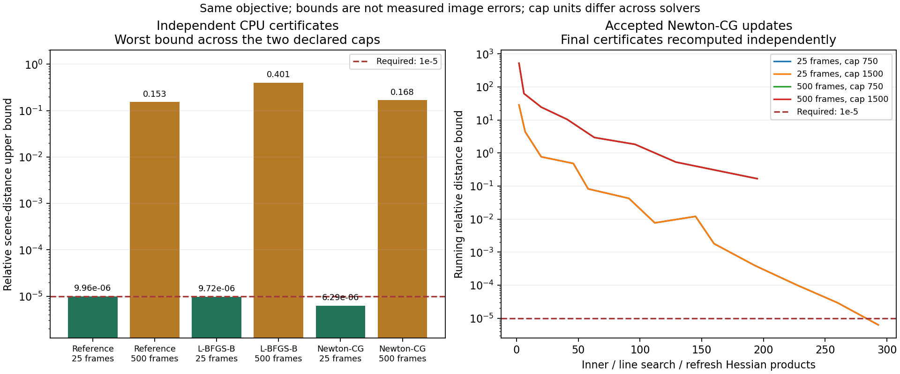

# Safeguarded Newton-CG endpoint comparison

The declared two-endpoint study completed in 769.85 seconds with unchanged source,
input and manifest identities. The 25-frame endpoint passes; the 500-frame
endpoint remains incomplete. No production adoption or scientific gate follows.

| Frames | Declared product caps | Accepted updates | Inner/search/refresh products | Independent relative distance bound | Outcome |
|---|---|---:|---|---:|---|
| 25 | 750 / 1500 | 13 / 13 | 293 / 293 | 6.29459e-6 / 6.29459e-6 | pass |
| 500 | 750 / 1500 | 9 / 9 | 219 / 220 | 0.167701 / 0.167701 | both wall-limited |

The fit times were 25.51/25.90 seconds for 25 frames and 302.58/302.64 seconds
for 500 frames, including final solver recomputation. Independent spatial CPU
checks followed each fit. Product caps count reduced-system, line-search and
gradient-refresh products, with initialization/final checks recorded separately;
they are not the earlier solvers' outer iteration caps or equal-work comparisons.

Every accepted step used the safeguarded Newton direction and decreased the
quadratic objective. Both cap runs produced identical terminal images at each
endpoint, but zero image change **cannot qualify the failed 500-frame solves**.
At 500 frames the deadline interrupted the next inner solve; its partial
direction was discarded while the last feasible accepted scene was retained.
Completed-stage reuse is available, not exact internal PCG resume.

For the independently certified 25-frame results, the objective difference from
the reference solver is 6.75973e-7, within the summed objective-gap bounds
1.86173e-6. No accuracy comparison against the incomplete 500-frame reference
is inferred. The figures show upper bounds, not measured reconstruction errors.

Validation: 18 Newton-CG dense/CPU/CUDA controls passed; full regression passed
792 tests with 48 opt-in tests skipped. The comparison tool's six tests distinguish
product caps from iteration caps and reject uncertified accuracy comparisons.
Routine regression and capture intake ran during parts of this invocation;
wall times are workload-dependent, not isolated speed records.

Next, complete the prospectively declared cache profile. Full-sequence spectra
exceed available GPU memory, while undersized LRU sweeps do not reuse entries.
Measure fixed admission at a bounded capacity without changing precision or the
objective. Preserve these failures. Faster products alone do not establish
convergence; subsequent constrained-solver work still requires a new identity,
explicit resource budget and the original independent acceptance criteria.
