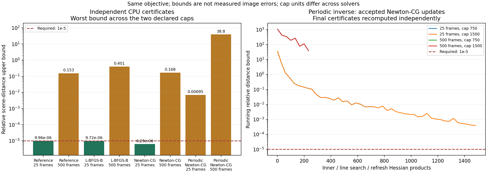

# Periodic-inverse constrained regression

The bounded experiment completed with unchanged source/input/manifest identities
in 930.28 seconds. Neither endpoint passed. The promising near-solution linear
probe did not predict the constrained trajectory from zero. This inverse is not
adopted into production or used to expand the numerical family.

| Frames | Product cap | Accepted updates | Products used | Independent relative distance bound | Stop |
|---|---:|---:|---:|---:|---|
| 25 | 750 | 23 | 750 | 0.00695438 | product cap |
| 25 | 1500 | 46 | 1500 | 0.000393582 | product cap |
| 500 | 750 | 8 | 265 | 38.8030 | 300s deadline |
| 500 | 1500 | 8 | 249 | 38.8030 | 300s deadline |

The two 25-frame outputs differ by 0.003532 in latent norm and 0.00013299 on the
detector, both above 1e-4. Both 500-frame runs retain the same eighth accepted
scene and fail the 1e-5 distance requirement by a wide margin; identical outputs
are not convergence. All accepted steps decrease the exact quadratic, but
descent alone is insufficient. The original diagonal Newton-CG passes 25 frames
and reaches bound 0.1677 at 500 frames; the coupled variant is a regression under
these protocols. Incomplete fits remain unsuitable as accuracy/speed baselines.

The retained inner traces explain the next diagnostic priority: only 2/23 and
2/46 accepted updates reached the declared 0.1 inner residual target at 25 frames;
only 1/8 did so in either 500-frame fit. The remaining accepted directions used
the 32-product cap. Partial unaccepted directions remain recorded separately.
Every accepted direction passed the Newton descent test; no majorizer fallback
was triggered. This is descriptive evidence, not proof of a single failure cause.

A window-aware candidate now has dense mathematical controls: the original
periodic data symbol assumes detector-density sampling across the entire native
scene, including its margin. Conserving total observation weight instead gives
sum(detector weights)/native cell count. The alternative matches the exact
Fourier diagonal for interior complete PSF footprints in dense tests and stays
positive on reduced subspaces. It remains unqualified on full-size trajectories.
See [the derivation and limits](../../docs/scene-window-preconditioner.md).

Next compare diagonal, original periodic and window-aware inverses on both early
and near-solution states at 25 and 500 frames, with independent residual checks,
finite-boundary and active-mask sensitivity. Predeclare that diagnostic before
another fit. Preserve all current failures; do not raise fit deadlines, relax
tolerances or tune the scientific prior to conceal this regression.

Validation this turn: 821 default regression tests passed, 52 opt-in tests skipped;
26 constrained CPU/CUDA controls passed. Additional timestamp, window-inverse
and trace-analysis tests passed separately. Historical reports, private capture
pixels and production defaults remain unchanged. Full-family, scientific quality
and Gate-1/Q2/Q3 qualification remain incomplete.
