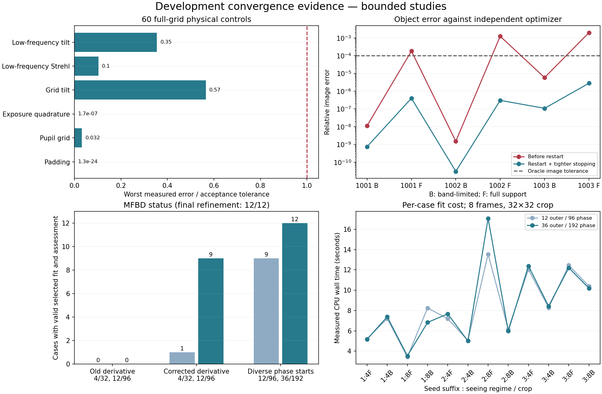

# Scientific convergence continuation

The bounded development convergence family passes all 12 cases after corrections
and targeted refinement. This establishes the declared numerical controls; it is
not the original full-resolution Gate-1/Q2 experiment and does not authorize Q3.

## Corrections and coverage

The object solver now restarts excess momentum and checks the current projected
gradient with a warm constraint projection. All six independent quadratic-oracle
cases pass from both starts at 512 iterations; doubling that cap is unchanged.
Maximum relative oracle image error is 2.8072e-6.

The atmospheric derivative had an incorrect transpose in PSF flux normalization.
On a large-shift physical case its finite-difference error was 0.6893; the corrected
derivative reaches 1.385e-8 at step 1e-4. Joint convergence now evaluates phases at
the final reconstructed object, checks image/OTF stability, and carries separate
selection and assessment partitions. A reproducible nonzero phase start avoids
limiting both initializations to a symmetric stationary point.

The MFBD study covers all three development seeds, D/r0 4/8, feature/bland crops,
both object/phase starts and modes 15/35/60. Each reduced case has eight frames,
a 16-sample pupil diameter and a 32x32 detector crop. All-frame reconstructions
use all eight; split fits use six training, one selection and one assessment frame.

At 12 outer / 96 phase versus 36 outer / 192 phase iterations, nine selected
models pass the declared comparisons. A stricter check of every initialization
and intermediate mode identifies four cases requiring refinement, including one
unselected start. The final refinement compares 36/192 against 72/384 for those
four, retaining all tolerances. Together with the eight previously qualifying
cases, **all 12 cases pass for both initializations at every mode stage**.
The refined images and closure values are identical between budgets. Maximum
cross-start all-frame image difference in the main study is 1.291e-6, below 1e-3.
The main study took 345.55 s and peaked at 663.81 MiB cumulative process RSS.
All six reduced-grid low-frequency ranking comparisons pass.

Independently, all 60 full-grid physical controls pass at 128x128 detector size,
covering padding, 64/128 pupil sampling, 8/16 exposure quadrature and low-frequency
Strehl/tilt moments across every development seed/regime and both crops.

## Evidence and limits

- `r10-joint-budget-audit` preserves the pre-correction failures.
- `r10-joint-budget-audit-v2` records the corrected derivative before phase-start diversity.
- `r10-joint-budget-audit-v3` and `r10-joint-budget-refinement-v2` form the final
  bounded convergence evidence. Both verify unchanged package source during execution.
  The earlier three-case refinement only checked selected-model eligibility; the
  four-case refinement supersedes it for the stronger all-initialization claim.
- Case traces are losslessly stored as `.json.gz`; reports retain both compressed
  and original JSON SHA-256 identities. `tools/archive_audit.py` performs archival
  after execution. No private captures or derived capture pixels are committed.
- The fixed scalar-noise approximation has measured variance relative RMS
  0.0152–0.3746 across these simulated crops; maximum inverse-weight relative RMS
  is 5.936. Quantification does not establish a calibrated heteroscedastic likelihood.
- Earlier phase-model decomposition measured a reduced-grid median 60-mode
  basis-only OTF error of 0.0843 and exposure-only error of 0.00310. Those model
  limitations remain; numerical stationarity is not model correctness or phase
  identifiability.

The next acceptance work is the original complete full-resolution reconstruction
and gap families under the corrected method, model/noise sensitivity and external
capture qualification. The measured production-size CPU gradients take roughly
17.5–19.8 ms. At 100 gradient calls per frame per stage, a 500-frame three-stage
fit represents about 0.79 CPU work-unit hours before object updates, simulation,
I/O, multiple starts and family multiplicity. This is a cost scenario, not an
end-to-end runtime promise. Q3 remains gated and the atmospheric solver remains
experimental; the validated baseline and release automation are separate.

Reproduce the bounded runs with `python -m planetrecon.budget_audit --out NEW_DIRECTORY`,
then `tools/refine_joint_convergence.py --parent THAT_DIRECTORY --out NEW_REFINEMENT`.
Use the project venv for these commands. Plot with system Python and
`tools/plot_convergence_audits.py`; no new development package was required.

Local validation: 526 regression tests passed and 41 skipped; the subsequently
added compressed-evidence/family-integrity and resource-forecast checks also pass.

The subsequent 500-frame full-resolution studies and remaining acceptance work
are recorded in [the full-grid continuation](../r10-full-grid-summary/DECISION.md).
They expose crop-forward model mismatch and unresolved full-grid stationarity;
the bounded acceptance above must not be extrapolated to full-grid qualification.
