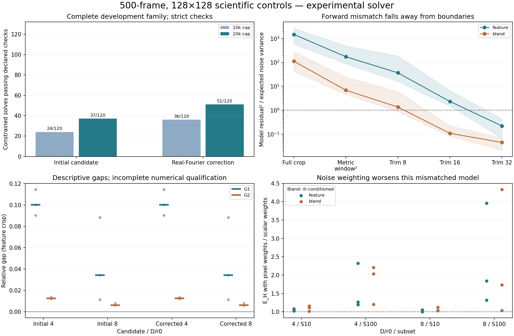

# Full-resolution scientific continuation

The full development family now has reconstruction, gap, noise-weight and
boundary-mismatch evidence at 500 frames and 128×128 detector resolution.
Scientific acceptance remains incomplete: small image changes do not satisfy
all numerical stopping checks, and the deployed crop-forward model has a large
systematic discrepancy with the padded optical simulator.



## Completed work

- Generated and certified all 30 development/evaluation input sequences:
  seeds 1001–1003 and 2001–2012, both D/r0 4/8, 500 frames each and both crops.
  `../r10-full-grid-inputs/manifest.json` records checksums and method identities.
  The HDF5 arrays remain local; no private capture pixels are committed.
- Executed every development seed/regime/crop combination at every practical
  selection fraction (5/10/25/50/100%), with doubled quadratic-solver budgets.
  The initial nested-projection FISTA attempt was stopped after about 15 minutes
  without a complete case; it remains explicitly incomplete.
- Added an experimental ADMM quadratic candidate with exact spectral support,
  a feasible nonnegative output, dual stationarity and a computed primal/dual
  bound on distance to the unique optimum. A DC-only feasibility correction
  preserves spectral support; its objective cost is included in the bound.
  This is the same positivity/support quadratic, not an extra image prior.
  Independent dense constrained oracles cover three seeds, two support choices
  and three starts; exact identity and unconstrained controls also pass.
- Corrected the candidate's real-Fourier normal equation after fractional
  registration. On even grids, restricting the quadratic to real images must
  precede diagonal inversion. A separate dense complex spatial operator
  regression verifies the resulting real normal matrix.
- Completed 12 full-grid noise cases, testing S10/S100 and 256/512 CG caps.
  All 48 solves converge and all doubled-budget images are identical. Per-pixel
  oracle weighting worsens both E_H and image MSE in all 24 subset/crop cases.
- Localized noiseless model error over the full crop, the metric window, and
  fixed 8/16/32-pixel interior borders. No automatic trimming is introduced.

## Numerical result and its limits

The corrected candidate's complete 12-case study is in
`../r10-full-gate1-admm-development-v2`. It uses 10000/20000 iteration caps,
stationarity tolerance 1e-8, relative optimum-distance bound 1e-4, image budget
stability tolerance 1e-3 and absolute relative-gap stability tolerance 0.01.

At the two caps, **36/120 and 51/120 constrained solves pass every declared
check**, compared with 24/120 and 37/120 in the first candidate. Every crop case
still contains at least one incomplete solve. At 20000 iterations the worst
computed relative solution-error bound is 4.234e-4 and worst dual stationarity
residual is 4.809e-7. Neither tolerance was relaxed to accept these cases.

The maximum image change between budgets is 2.895e-5 and the maximum absolute
G1/G2/G3 change is 4.071e-5. These stability observations are retained alongside
the failed stopping checks. The descriptive feature medians are G1=0.10026 and
G2=0.01245 at D/r0=4, and G1=0.03426 and G2=0.00620 at D/r0=8. They are not a
certified Gate-1 classification. Bland high-band metrics remain ill-conditioned.

The corrected study took 417.03 seconds using four two-thread workers. The
first candidate took 531.35 seconds under a different concurrent workload;
these are recorded runtimes, not a controlled speedup benchmark. The production
estimator and MFBD path are not replaced by this experimental candidate.

## Model/noise result

Known noise divided by its true variance has mean square 0.9983–1.0045. In
contrast, deterministic forward-model discrepancy is 41.85–2711.66 in the same
units over the full crop. The squared metric window still leaves 4.54–489.07;
the central 64×64 region reduces it to 0.0212–0.4371. Shading in the boundary
plot is the range across development seeds/regimes; points are medians.

Replacing frame-average variance with per-pixel expected-plus-read variance
changes the reconstruction by 11.1–47.6%. Feature-crop E_H worsens by factors
1.004–3.963. These measurements demonstrate sensitivity under the current
forward-model approximation, not a reason to claim that the detector variance
is spatially constant. Production weighting remains unchanged. Detailed
evidence is in `../r10-full-noise-weight-sensitivity/DECISION.md`.

## Remaining acceptance work

1. Use the shared padded scene / optical convolution / detector integration /
   crop forward and adjoint in reconstruction, or independently qualify an
   interior approximation. Repeat noiseless model and noise-weight controls;
   the present metric taper is insufficient.
2. Complete strict constrained-solver stationarity and error-bound checks on
   the resulting operator. Preserve both failed studies and fixed tolerances;
   measured image stability alone cannot certify the solution.
3. Freeze the method on development data, then run the complete evaluation
   reconstruction/gap family and full low-frequency ranking/gap follow-up.
   Evaluation inputs are ready, but evaluation reconstruction was not started
   on the incomplete development method.
4. Repeat full-resolution Q2 with independently checked gradients, both
   initializations, separate selection/assessment partitions and phase/exposure
   model sensitivity. Q3 and production MFBD remain gated. External capture
   qualification is still separate.

## Reproduction and verification

```sh
.venv/bin/python tools/audit_full_gate1.py --inputs out/r10-full-gate1/inputs --out NEW_DIRECTORY --solver admm --budgets 10000 20000 --workers 4
.venv/bin/python tools/audit_noise_weights.py --inputs out/r10-full-gate1/inputs --out NEW_NOISE_DIRECTORY
.venv/bin/python tools/audit_crop_model.py --inputs out/r10-full-gate1/inputs --out NEW_MODEL_DIRECTORY
MPLCONFIGDIR=/tmp/planetrecon-mpl python3 tools/plot_full_grid_audits.py --out NEW_PLOT_DIRECTORY
```

Full case traces are losslessly compressed JSON with compressed and original
SHA-256 identities. Protocols retain source and candidate identities, input
hashes, all frame memberships, photon counts and convergence diagnostics.
The regression suite passed 557 tests with 41 skipped; two additional evidence
integrity tests passed after final archival. The PNG/SVG plots were rendered
and visually checked. No new packages were required.
